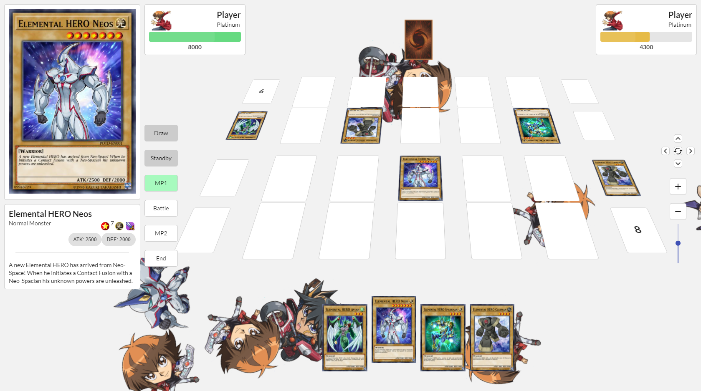
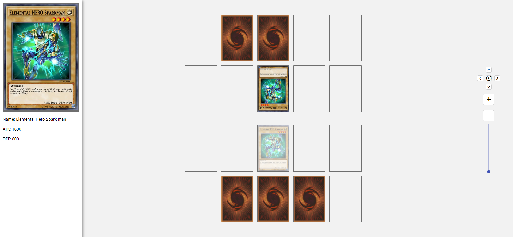

# Duel Disk OS

A browser-based Yu-Gi-Oh! TCG dueling simulator built with React, Redux, and Socket.io. Play against a friend in real-time or test solo against a CPU opponent, with support for the full modern summoning catalogue — Normal, Tribute, Ritual, Fusion, Synchro, XYZ, Pendulum, and Link Summons.



---

## Features

**Core Gameplay**
- Full turn structure: Draw → Standby → Main Phase 1 → Battle → Main Phase 2 → End Phase
- Normal, Tribute, Set summoning
- Battle system with direct attacks and monster-vs-monster combat, ATK/DEF resolution
- Monster position changes: Flip Summon (face-down DEF → face-up ATK), Battle Position Change (ATK ↔ DEF)
- Spell and Trap card activation (face-down flip-activate)
- Graveyard and Extra Deck zone viewers

**Advanced Summoning**
- Ritual Summon (tribute from hand/field, level-sum matching)
- Fusion Summon via Polymerization — material selection UI
- Synchro Summon — Tuner + non-Tuner level-sum targeting
- XYZ Summon — overlay same-level monsters, detach material effects
- Pendulum Summon — dual scale placement, mass summon within scale window
- Link Summon — link rating material targeting

**Card System**
- Live card data + art from the [YGOPRODeck API](https://ygoprodeck.com/api-guide/) with 7-day localStorage cache
- Auto-generated card effects from description text (draw, gain LP, burn damage, destroy, search)
- Hand-authored effects for key cards (Polymerization, Monster Reborn, Pot of Greed, Mirror Force, etc.)
- On-summon triggered effects (e.g. burn on Normal/Special Summon)

**Multiplayer**
- Real-time 1v1 via Socket.io with automatic deck exchange
- Reconnection grace period (60 s) — refresh the tab without losing your duel
- Coin-flip first-turn determination

**Included Test Decks**
| Deck | Strategy |
|---|---|
| Classic | Vanilla beatdown — Blue-Eyes, Dark Magician |
| Synchron Stardust | Junk Synchron engine → Stardust Dragon |
| Number XYZ | Gagaga / Zubaba / Achacha → Number 39 Utopia |
| Performapal Odd-Eyes | Pendulum scale 1–8, Odd-Eyes boss monsters |
| Decode Talker | Link engine with Dotscaper / Backup Secretary |

---

## Screenshots

| Field | Hand options | Fusion summon |
|---|---|---|
|  |  |  |

---

## Tech Stack

| Layer | Tech |
|---|---|
| Frontend | React 18, Redux, react-redux, react-transition-group |
| UI | MUI v5, Semantic UI React |
| Realtime | Socket.io-client (frontend) / Socket.io (server) |
| Card data | YGOPRODeck REST API — free, no key required |
| Build | Create React App |
| Server | Node.js, http, socket.io |

---

## Getting Started

### Prerequisites
- Node.js 18+
- npm or yarn

### 1. Start the game server

```bash
cd dueldisk_server
npm install
node index.js
# Server starts on port 4001
```

### 2. Start the frontend

```bash
cd yugioh_web-master
npm install
npm start
# Opens on http://localhost:3000
```

Open two browser tabs (or two machines on the same server) to start a duel. Cards load on-demand from the YGOPRODeck API on first use and are cached locally.

---

## Project Structure

```
duel-disk-os/
├── yugioh_web-master/        # React frontend (CRA)
│   ├── src/
│   │   ├── Components/
│   │   │   ├── Card/         # CardView, card constants & utils
│   │   │   └── PlayerGround/ # Game, Field, Hand, PhaseSelector, CardSelector, DuelLog
│   │   ├── Core/
│   │   │   ├── Summon/       # summon(), tribute(), sendToGY(), changePosition()
│   │   │   ├── Battle/       # attack resolution, damage calc
│   │   │   └── Effect/       # effect activation, trigger registry
│   │   ├── Store/            # Redux actions, reducers, store
│   │   └── data/
│   │       ├── cardApi.js    # YGOPRODeck API + localStorage cache
│   │       ├── cardLoader.js # API response → internal card object
│   │       ├── deckRegistry.js  # Built-in test decks
│   │       ├── effectAutoGen.js # Description-pattern → auto effect
│   │       └── effectsRegistry.js # Hand-authored card effects
│   └── screenshots/
└── dueldisk_server/          # Node.js matchmaking + relay server
    └── index.js
```

---

## Roadmap

- [ ] Deck Builder UI with card search and persistent deck storage
- [ ] Card Scanner — phone camera OCR to import physical decks
- [ ] Duel Log & Replay system
- [ ] 3D field with animated card summons
- [ ] CPU AI opponent
- [ ] Full rules engine (priority, chain links, timing)

---

## Credits

Based on [rickypeng99/yugioh_web](https://github.com/rickypeng99/yugioh_web) — original two-player field and battle system.

Card data and images courtesy of [YGOPRODeck](https://ygoprodeck.com/).

Yu-Gi-Oh! is a trademark of Konami. This project is unofficial and not affiliated with or endorsed by Konami.
